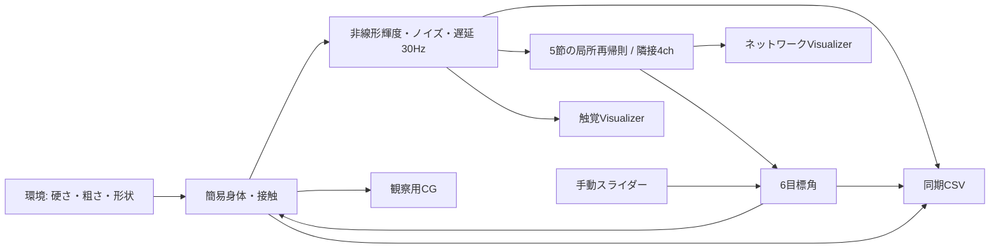

# Inchworm Tactile — 非視覚・分散AIのデスクトップ試作

Quest 3不要。Python 3.12と標準ライブラリのTkinterだけで動く、小規模な触覚移動ラボです。
`run.bat` をダブルクリック、またはこのフォルダで `python app.py` を実行してください。

[実行画面](docs/visualizer.png) · [初回の検証結果](docs/validation.md)
初回探索の重みは「重みを読む」から `docs/training-example.json` を選択できます。

## 今回の範囲

- 5節・各ピッチ1軸＋頭部ヨー1軸。腹側45セル、頭部9セル、15 mmピッチ。
- 30 Hz固定のシミュレーション。画面と実行倍率を変えても物理刻みは同じ。
- 触覚だけを入力する、4状態・隣接節通信の共有局所再帰則。中央制御器はありません。
- 人間向けの疑似3D CG、グレースケール触覚、ネットワークの接続・内部状態・共有パラメータ・目標角と実角を同時表示。
- 手動角度入力、材質別接触シナリオ、同期CSV記録、HP報酬による小規模な進化的重み探索。

**研究用の簡易モデルです。学習済みの自律探索AIや実機物理の再現ではありません。**
ネットワークには最初から周期運動の初期位相と進行波の局所結合を与えています。
学習は8個の共有パラメータの変異・選択で、勾配学習や模倣学習はまだ実装していません。
CGはTk Canvasの斜投影であり、Unityの3Dレンダリングではありません。

## 操作と目視確認

1. 「両方」で本体と触覚を同時に見ます。Spaceで停止、Tabで本体／触覚／両方を循環します。
2. シナリオを地面・餌・害・段差に切り替え、接触による濃淡を比較してください。切替時はリセットし、記録中ならファイルを閉じます。
3. 「手動目標角」で6本のスライダーから目標角を与えられます。ネットワークの状態更新は停止します。
4. ガンマ・表示ゲイン・セル間隔・腹側の縦配置を変更できます。これは表示だけの変更でAI入力・ログには影響しません。
5. 「記録開始」で `sessions/日時.csv` を作成します。停止・リセット・画面終了時に閉じます。
6. 材質・ノイズ・遅延などは `config.json` を変更してアプリを再起動します。

ネットワーク表示の緑／赤は正／負、円の大きさは状態値の絶対値です。節間の矢印は実際の4チャネルの双方向通信です。
HP・座標・CGは観察者用で、制御器に渡されません。触覚だけの表示モードでもネットワーク観察欄は残します。将来のHMD被験者画面は別途分離します。

## 学習とテスト

```powershell
python -m unittest -v
python train.py --generations 10 --population 8 --seconds 45
python app.py --weights checkpoints/best.json
```

報酬はHPの時間積分だけです。位置や移動距離を報酬に使いません。探索器だけが報酬を読み、実行時の局所則はHPを読みません。
固定された環境で2ノイズseedを探索に、別の2seedを検証に使います。未知環境への汎化評価ではありません。
短い評価では餌や害に触れず全候補が同点になることがあります。改善しない結果もそのまま保存します。
`checkpoints/best.json` に初期値との比較、検証値、設定、乱数seed、履歴を保存します。

## データ形式

1セッション1CSV。先頭行は `# ` に続くJSONメタデータ（環境配置・センサ設定・重み・開始tick）。2行目が列名。
`pandas.read_csv(path, comment='#')` 等で学習用配列に読み込めます。pandas自体はアプリの依存ではありません。

各行はtick・秒、腹側45輝度、頭部9輝度、6目標角、6実角、HP、頭部xyz、頭部pitch/yaw/roll。
角度はrad、位置はm。腹側の順番は尾→頭の節順、各節は前後row×左右colのrow-major。
**輝度はその行の行動決定に使った遅延済み観測、実角・HP・姿勢はその行の行動適用後**です。
表示は次の行動に使う最新観測です。センサ遅延とログの因果関係を混同しないでください。
途中からの記録も可能ですが、完全なシミュレーション再開用スナップショットではありません。

## 構成



## センサと物理の近似

セル出力は `clamp(baseline + (1-baseline) * (1-exp(-gain*load)) + GaussianNoise, 0, 1)`。
`load = indentation * hardness * (1 + roughness*sin(1800*x+0.6)*cos(1600*y+0.3))`。
無荷重の底輝度、飽和、フレームノイズ、1～2フレームの遅延を再現します。
硬さと粗さは校正前の無次元値です。押し込み量も基準長で正規化しています。
柔らかさは輝度応答の低下で近似し、スポンジの体積変形や接触面積拡大の弾性計算は未実装です。

移動は低い節ほど滑りにくい準静的な接地点拘束で計算します。重力・質量・トルク・衝突インパルスは未実装。
5角は簡易的な各節の絶対ピッチで、実機の相対関節角と同一ではありません。左右ロールはありません。
段差は頭部接近時の並進抑制で近似し、全身剛体衝突や段差登りの正確な評価には使えません。
材質の当たり判定は円形、CGの物体は見やすさのため角柱で表示しています。
反射型TacTipへの適合・材質の識別・前進周期・障害物回避の受け入れ判定は、人間の目視と実測校正が必要です。

## Unity / Quest 3への接続計画

このPython版は局所則・触覚応答・ログ契約・観察UIの先行検証を担当します。
Unity 6 + URP版は実関節・剛体接触・正しい3D CGを担当し、同じ54輝度→6目標角の境界を維持します。
その後Meta XRで観察者画面とHMDの触覚専用画面を分離します。今はSDKやHMD接続を追加していません。

| 将来の入力案 | 特徴 | 記録への変換 |
|---|---|---|
| A: 左スティックで節選択、右上下で角度 | 個別調整しやすいが切替が必要 | 5 pitch＋頭yaw |
| B: 両手の傾きで前半／後半 | 協調操作しやすいが姿勢校正が必要 | 群の角度を各節へ展開 |
| C: トリガーで収縮度 | 最小入力だが探索範囲が固定波形に制限される | 固定波形を各節角へ展開 |

頭yawは各案とも空いているスティック左右に割り当てます。人間の指示も節目標角に正規化します。
次工程は実測センサ校正、相対関節＋剛体物理への移行、ログからの局所模倣学習、複数環境でのHP学習、最後にQuest表示です。
別のAIへの依頼文は、元設計依頼の指定どおり作成していません。
